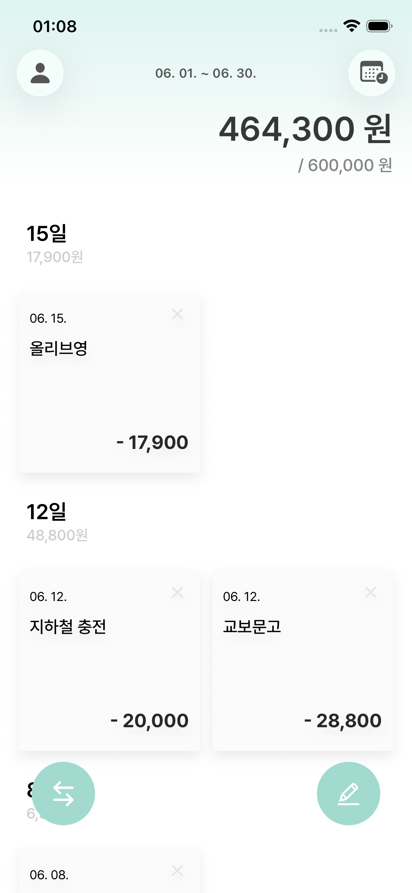
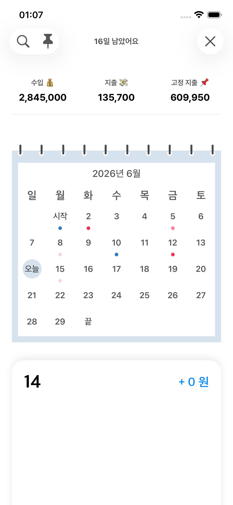
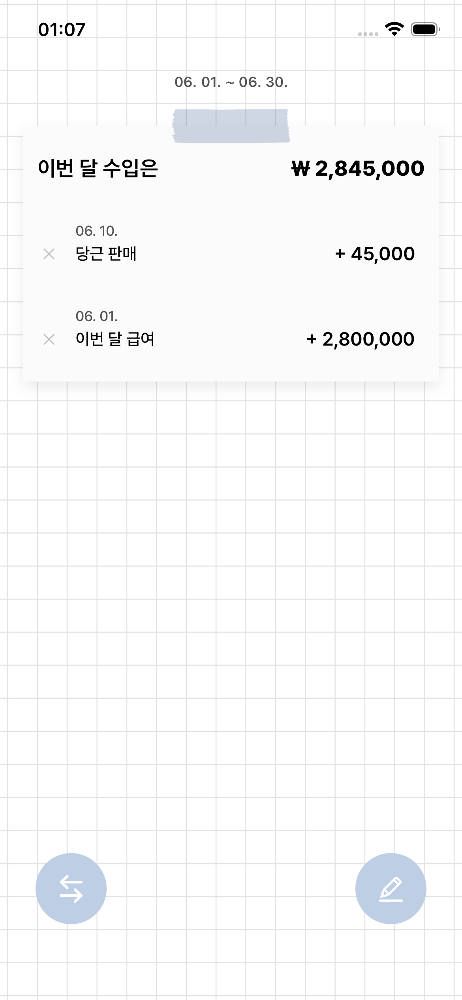

# CostIt (코스트잇)

> 심플하고 직관적인 iOS 개인 가계부 앱


수입과 지출을 메모지에 적듯 기록하고, 캘린더로 한눈에 돌아보고, 고정 지출은 알림으로 챙기는 가계부입니다. iCloud로 기기 간 자동 동기화되고, 홈 화면 위젯으로 잔액을 바로 확인할 수 있습니다.

## 스크린샷

| 메인 | 캘린더 | 고정 지출 | 수입 |
|:---:|:---:|:---:|:---:|
|  |  |  |  |
| 잔액·날짜별 메모지 | 월별 지출/수입 점 표시 | 반복 지출 + 알림 | 월 수입 내역 |

## 주요 기능

- 💸 **지출 / 수입 기록** — 날짜·내용·금액을 빠르게 추가·수정·삭제
- 📅 **캘린더 조회** — 월별 달력에서 지출/수입/고정 지출을 점 색상으로 표시, 정산 기간의 시작·끝·오늘 라벨
- 📌 **고정 지출 + 푸시 알림** — 매달 반복되는 지출(구독료·월세 등)을 등록하면 결제 전날 알림
- 💰 **급여일 기준 정산 기간** — 급여일(예: 25일)에 맞춰 한 달 정산 주기를 자동 계산
- 🔍 **검색** — 기록한 내역을 키워드로 검색
- 📱 **홈 화면 위젯** — 현재 잔액을 위젯으로 바로 확인
- ☁️ **iCloud 동기화** — 여러 기기에서 같은 데이터 (CloudKit private DB)
- 🌙 **다크 모드** 지원

## 기술 스택

| 영역 | 기술 |
|------|------|
| UI | SwiftUI |
| 데이터 | SwiftData (+ CloudKit 동기화) |
| 위젯 | WidgetKit (SwiftData 직접 쿼리) |
| 기기 간 공유 | App Group (`group.costit`) |
| 최소 버전 | iOS 17.0+ |

외부 의존성 없음 (CocoaPods 미사용). `saveMoney.xcodeproj`로 직접 빌드합니다.

## 아키텍처

- **단일 데이터 소스**: SwiftData가 source of truth. 앱과 위젯이 App Group 컨테이너를 공유하고, CloudKit private DB로 기기 간 동기화됩니다.
- **앱 루트**: SwiftUI `MainView`를 루트로 사용합니다 (스토리보드 미사용).
- **데이터 모델** (`@Model`)
  - `FinDataEntity` — 지출/수입 (`isRevenue`로 구분)
  - `FixedExpenditureEntity` — 고정 지출
  - `ProfileEntity` — 사용자 프로필 (닉네임·예산·급여일)
  - `SalaryPeriodEntity` — 현재 정산 기간
- **레거시 데이터 이전**: 구버전(UserDefaults 기반)에서 업데이트한 사용자의 데이터는 첫 실행 시 `LegacyMigration`이 SwiftData로 자동·멱등 이전합니다.

## 프로젝트 구조

```
saveMoney/
├─ Views/                 # SwiftUI 화면
│  ├─ MainView            # 메인 대시보드 (앱 루트)
│  ├─ CalendarView        # 월별 캘린더 (자체 MonthCalendarGrid)
│  ├─ AddFinView          # 지출/수입 추가·수정
│  ├─ RevenueView         # 수입 관리
│  ├─ FixedExpenditureView# 고정 지출 + 알림
│  ├─ SearchView          # 검색
│  └─ FirstOpenView       # 온보딩 / 프로필 수정
├─ Persistence/           # SwiftData 레이어
│  ├─ Models              # @Model 4종
│  ├─ PersistenceController # App Group + CloudKit 컨테이너
│  └─ LegacyMigration     # UserDefaults → SwiftData 이전
├─ struct.swift           # 공용 모델·Date/String/Int 확장
├─ AppDelegate / SceneDelegate
widget/                   # 홈 화면 위젯
```

## 빌드 & 실행

요구 사항: Xcode 26+, iOS 17.0+

```bash
xcodebuild -project saveMoney.xcodeproj -scheme saveMoney \
  -destination 'platform=iOS Simulator,name=iPhone 17e,OS=26.5' build
```

또는 Xcode에서 `saveMoney.xcodeproj`를 열고 `saveMoney` scheme으로 실행합니다.

> CloudKit 동기화를 사용하려면 `iCloud.kr.co.saveMoney` 컨테이너와 `group.costit` App Group이 설정된 Apple Developer 계정이 필요합니다.

## CI/CD

`main` 브랜치 push 시 Xcode Cloud가 자동으로 아카이브합니다.

## 라이선스

별도 명시 전까지 모든 권리는 저작권자에게 있습니다.
